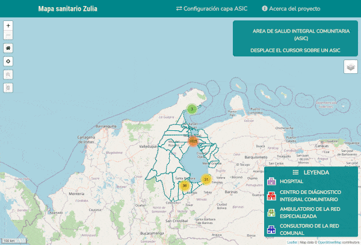

# Mapa sanitario del Estado Zulia
Plantilla  de diseño web adaptable  (del ingles _responsive web design_) 
para crear aplicaciones de mapas web con __LeafletJS__.

## :eye_speech_bubble: Overview



## Demo

[Demo](http://jfcoordenadas.xyz/mapa_zulia/)

## :keyboard: Framework
- [Font Awesome](https://fontawesome.com/)
- [sweetAlert2](https://sweetalert2.github.io/)
- [Leaflet JS](https://leafletjs.com/)

### Plugin Leaflet

- [TopoJson](http://bl.ocks.org/hpfast/2fb8de57c356d8c45ce511189eec5d6a)
- [Leaflet marker Cluster](https://github.com/Leaflet/Leaflet.markercluster)
- [Leaflet Awesome Markers V2](https://github.com/lennardv2/Leaflet.awesome-markers)
- [Leaflet EasyButton](https://github.com/CliffCloud/Leaflet.EasyButton)
- [Leaflet GridLayer GoogleMutant](https://gitlab.com/IvanSanchez/Leaflet.GridLayer.GoogleMutant/tree/master)


## :rocket: Instalación
Clonar proyecto
```
	git clone https://github.com/juanfernandez2306/map_leaflet_simple.git
```
Descargar fotos de los establecimientos de salud y descomprimir en la carpeta __assets/img_estab/__ del proyecto
```
	https://drive.google.com/file/d/1qUCd3K79VdLJchaMjfwF80DDyUfmrFKE/view?usp=sharing
```
- Crear una base de datos MySQL con codificación UTF-8
- Nombre de la base de datos _mapa_zulia_
- Cargar script sql/bd.sql
- Cargar script sql/establecimientos_salud.sql
- De ser necesario modificar parametros de conexión bd en assets/php/Class/Constants.php

## :bust_in_silhouette: Contactos
- Twitter : https://twitter.com/juancho_2306

## Licencia
Este proyecto está bajo la Licencia [MIT](/LICENSE) - mira el archivo [LICENSE.md](LICENSE.md) para detalles.